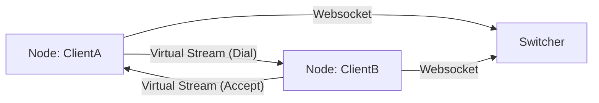

# FLEX - Reliable Multiplexing Network Library

`flex` is a high-performance, improved stream multiplexing library built on top of reliable connections (TCP, WebSocket). It abstracts complex network interactions into simple `Node`, `Switcher`, and `Stream` concepts, allowing developers to build complex peer-to-peer or relay networks with ease.

[](https://codecov.io/gh/net-agent/flex)

## Key Features

-   **Stream Multiplexing**: Run practically unlimited logical streams over a single physical connection (e.g., WebSocket).
-   **Node & Switcher Architecture**: 
    -   **Node**: Acts as a client or agent. Can Dial or Listen on virtual ports.
    -   **Switcher**: Acts as a relay server. Routes traffic between Nodes using virtual domains and IPs.
-   **Fair Scheduling**: Built-in **Fair Queuing** ensures that a single high-bandwidth stream cannot starve control signals (ACKs, Pings) or other small streams.
-   **Observability**: Integrated **Admin API** for both Node and Switcher to monitor traffic, active streams, and latency in real-time.
-   **Reliability**: Robust connection management with active/passive close handling and keep-alive mechanisms.

## Architecture



## Quick Start

### Installation

```bash
go get github.com/net-agent/flex/v2
```

### 1. Minimal Node-to-Node (Direct) used

You can use `flex` to multiplex any `net.Conn`.

```go
package main

import (
	"log"
	"net"
	"github.com/net-agent/flex/v2/node"
	"github.com/net-agent/flex/v2/packet"
)

func main() {
    // Assume we have a physical connection (TCP/WS)
    conn, _ := net.Dial("tcp", "127.0.0.1:8080")
    
    // Create a Node
    n := node.New(packet.NewWithConn(conn))
    
    // Serve requests
    go n.Serve()
    
    // Open a virtual stream
    stream, err := n.Dial("remote-domain:80")
    if err != nil {
        log.Fatal(err)
    }
    
    // Use stream like net.Conn
    stream.Write([]byte("Hello"))
}
```

### 2. Using Switcher (Relay Mode)

See [examples/ws-gate](examples/ws-gate/main.go) for a complete example of running a Switcher gateway.

```go
// Start Switcher
s := switcher.NewServer("password")
// Handle incoming connections
go s.ServeConn(pconn, ...)
```

## Documentation

For detailed usage, configuration, and API reference, please see the **[Developer Manual](docs/manual.md)**.

## Observability

Flex includes a built-in HTTP Admin Server.

```go
// Start Admin for Node
admin := node.NewAdminServer(n, ":8081")
go admin.Start()
```

Access metrics at `http://localhost:8081/api/v1/info` or `.../streams`.

## License

MIT
