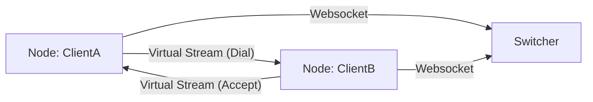

# FLEX - Reliable Multiplexing Network Library

`flex` is a high-performance, improved stream multiplexing library built on top of reliable connections (TCP, WebSocket). It abstracts complex network interactions into simple `Node`, `Switcher`, and `Stream` concepts, allowing developers to build complex peer-to-peer or relay networks with ease.

[](https://codecov.io/gh/net-agent/flex)

## Key Features

-   **Stream Multiplexing**: Run practically unlimited logical streams over a single physical connection (e.g., TCP, WebSocket).
-   **Node & Switcher Architecture**:
    -   **Node**: Acts as a client or agent. Can Dial or Listen on virtual ports.
    -   **Switcher**: Acts as a relay server. Routes traffic between Nodes using virtual domains and IPs.
-   **Session with Auto-Reconnect**: `node.Session` wraps a Node with lazy connect, automatic reconnection with backoff, and listeners that survive reconnects.
-   **Fair Scheduling**: Built-in **Fair Queuing** (DRR-based, see `internal/sched`) ensures that a single high-bandwidth stream cannot starve control signals (ACKs, Pings) or other small streams. Enabled by default on both `switcher.Server` and `node.Session`.
-   **Inspection APIs**: `Node.GetInfo()` / `Node.GetListeners()`, `Switcher.GetStats()` / `Switcher.GetClients()`, and `Stream.GetState()` expose traffic counters, active streams, and RTT in real time.
-   **Reliability**: Robust connection management with heartbeat keep-alive and active/passive close handling.

## Architecture


```mermaid
graph LR
    A[Node: ClientA] -- Websocket --> S[Switcher]
    B[Node: ClientB] -- Websocket --> S

    A -- "Virtual Stream (Dial)" --> B
    B -- "Virtual Stream (Accept)" --> A
```

## Quick Start

### Installation

```bash
go get github.com/net-agent/flex/v3
```

### 1. Minimal Node-to-Node (Direct Mode)

You can use `flex` to multiplex any `net.Conn`. In direct mode both sides set their own domain and virtual IP manually:

```go
// Server side
server := node.New(packet.NewWithConn(srvConn))
server.SetDomain("server-node")
server.SetIP(1)
go server.Serve()

ln, _ := server.Listen(80)
conn, _ := ln.Accept() // conn is a *stream.Stream and implements net.Conn
```

```go
// Client side
client := node.New(packet.NewWithConn(conn))
client.SetDomain("client-node")
client.SetIP(2)
go client.Serve()

s, err := client.Dial("server-node:80") // or client.DialIP(1, 80)
if err != nil {
    log.Fatal(err)
}
s.Write([]byte("Hello"))
```

### 2. Using Switcher (Relay Mode)

The Switcher authenticates nodes with a password, assigns virtual IPs, and routes packets between domains:

```go
// Start the Switcher
srv := switcher.NewServer("password", nil, nil)
ln, _ := net.Listen("tcp", ":8080")
log.Fatal(srv.Serve(ln))
```

Nodes join the network with `node.Connect`, which performs the authenticated handshake and returns a ready-to-serve Node:

```go
conn, _ := net.Dial("tcp", "127.0.0.1:8080")
n, err := node.Connect(packet.NewWithConn(conn), "client-a", "", "password")
if err != nil {
    log.Fatal(err)
}
go n.Serve()

// Dial another node by domain
s, err := n.Dial("client-b:80")
```

See [examples/ws-gate](examples/ws-gate/main.go) for running a Switcher over WebSocket.

### 3. Session (Auto-Reconnect)

`node.Session` keeps the logical node alive across network failures: it reconnects with exponential backoff and re-registers all listeners after each reconnect.

```go
sess := node.NewSession(func() (packet.Conn, error) {
    conn, err := net.Dial("tcp", "127.0.0.1:8080")
    if err != nil {
        return nil, err
    }
    return packet.NewWithConn(conn), nil
}, node.SessionConfig{Domain: "client-a", Password: "password"})
go sess.Serve()

// The first Listen/Dial triggers the connection (lazy connect);
// the listener is restored automatically after every reconnect.
ln, err := sess.Listen(80)
```

## Examples

| Example | Description |
| --- | --- |
| [examples/echo](examples/echo/main.go) | Basic Switcher + two Nodes, echo over a virtual stream |
| [examples/ping](examples/ping/main.go) | RTT between nodes via `PingDomain` |
| [examples/tcp-proxy](examples/tcp-proxy/main.go) | TCP port forwarding through the flex network |
| [examples/ws-gate](examples/ws-gate/main.go) | Switcher gateway over WebSocket |
| [examples/web-client](examples/web-client) | Browser demo (Vue) talking flex over WebSocket |

## Documentation

For detailed usage, configuration, and API reference, please see the **[Developer Manual](docs/manual.md)**.

## Inspection APIs

Both Node and Switcher expose their runtime state programmatically:

```go
info := n.GetInfo()         // node domain, IP, network, bytes read/written
listeners := n.GetListeners()

stats := srv.GetStats()     // switcher active connections
clients := srv.GetClients() // online nodes: domain, IP, stream count, bytes, RTT
```

## License

MIT, see [LICENSE](LICENSE).
