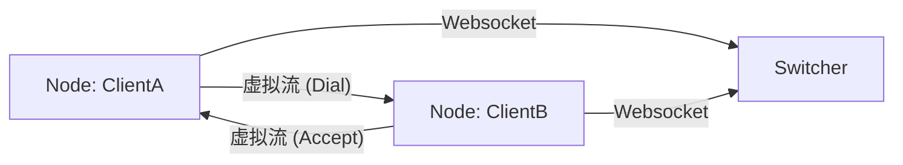

# FLEX - 可靠的多路复用网络库

`flex` 是一个基于可靠连接（TCP、WebSocket）构建的高性能流式多路复用库。它将复杂的网络交互抽象为简单的 `Node`、`Switcher` 和 `Stream` 概念，使开发者能够轻松构建复杂的点对点或中继网络。

[](https://codecov.io/gh/net-agent/flex)

## 核心特性

-   **流式多路复用**: 在单个物理连接（如 WebSocket）上运行几乎无限的逻辑流。
-   **Node & Switcher 架构**:
    -   **Node (节点)**: 作为客户端或代理。支持在虚拟端口上进行 Dial（拨号）或 Listen（监听）。
    -   **Switcher (交换机)**: 作为中继服务器。根据虚拟域名 (Domain) 和 IP 在节点间路由流量。
-   **公平调度**: 内置 **公平队列 (Fair Queuing)**，确保单个高带宽流不会阻塞控制信号（ACK、Ping）或其他小流量流。
-   **可观测性**: 为 Node 和 Switcher 集成了 **Admin API**，可实时监控流量、活跃流和延迟信息。
-   **可靠性**: 健壮的连接管理，拥有完善的主动/被动关闭处理及保活机制。

## 架构图



## 快速开始

### 安装

```bash
go get github.com/net-agent/flex/v3
```

### 1. 最小化 Node-to-Node (直连模式)

你可以使用 `flex` 对任何 `net.Conn` 进行多路复用。

```go
package main

import (
	"log"
	"net"
	"github.com/net-agent/flex/v3/node"
	"github.com/net-agent/flex/v3/packet"
)

func main() {
    // 假设建立了一个物理连接 (TCP/WS)
    conn, _ := net.Dial("tcp", "127.0.0.1:8080")
    
    // 创建 Node
    n := node.New(packet.NewWithConn(conn))
    
    // 启动服务循环
    go n.Serve()
    
    // 打开一个虚拟流
    stream, err := n.Dial("remote-domain:80")
    if err != nil {
        log.Fatal(err)
    }
    
    // 像使用 net.Conn 一样使用 stream
    stream.Write([]byte("Hello"))
}
```

### 2. 使用 Switcher (中继模式)

请参考 [examples/ws-gate](examples/ws-gate/main.go) 查看完整的 Switcher 网关运行示例。

```go
// 启动 Switcher
s := switcher.NewServer("password")
// 处理传入连接
go s.ServeConn(pconn, ...)
```

## 文档

关于详细的使用方法、配置和 API 参考，请参阅 **[开发者手册](docs/manual_zh.md)**。

## 可观测性

Flex 内置了一个 HTTP Admin Server。

```go
// 为 Node 启动 Admin
admin := node.NewAdminServer(n, ":8081")
go admin.Start()
```

访问 `http://localhost:8081/api/v1/info` 或 `.../streams` 获取指标。

## 许可证

MIT
