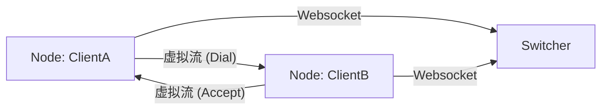

# FLEX - 可靠的多路复用网络库

`flex` 是一个基于可靠连接（TCP、WebSocket）构建的高性能流式多路复用库。它将复杂的网络交互抽象为简单的 `Node`、`Switcher` 和 `Stream` 概念，使开发者能够轻松构建复杂的点对点或中继网络。

[](https://codecov.io/gh/net-agent/flex)

## 核心特性

-   **流式多路复用**: 在单个物理连接（TCP、WebSocket）上运行几乎无限的逻辑流。
-   **Node & Switcher 架构**:
    -   **Node (节点)**: 作为客户端或代理。支持在虚拟端口上进行 Dial（拨号）或 Listen（监听）。
    -   **Switcher (交换机)**: 作为中继服务器。根据虚拟域名 (Domain) 和 IP 在节点间路由流量。
-   **Session 自动重连**: `node.Session` 在 Node 之上提供懒连接、指数退避自动重连，监听器在重连后自动恢复。
-   **公平调度**: 内置基于 DRR 的**公平队列**（见 `internal/sched`），确保单个高带宽流不会阻塞控制信号（ACK、Ping）或其他小流量流。`switcher.Server` 与 `node.Session` 默认启用。
-   **状态查询 API**: `Node.GetInfo()` / `Node.GetListeners()`、`Switcher.GetStats()` / `Switcher.GetClients()`、`Stream.GetState()` 可实时获取流量统计、活跃流与 RTT。
-   **可靠性**: 健壮的连接管理，拥有心跳保活及完善的主动/被动关闭处理机制。

## 架构图


```mermaid
graph LR
    A[Node: ClientA] -- Websocket --> S[Switcher]
    B[Node: ClientB] -- Websocket --> S

    A -- "虚拟流 (Dial)" --> B
    B -- "虚拟流 (Accept)" --> A
```

## 快速开始

### 安装

```bash
go get github.com/net-agent/flex/v3
```

### 1. 最小化 Node-to-Node（直连模式）

你可以使用 `flex` 对任何 `net.Conn` 进行多路复用。直连模式下两端各自设置域名和虚拟 IP：

```go
// 服务端
server := node.New(packet.NewWithConn(srvConn))
server.SetDomain("server-node")
server.SetIP(1)
go server.Serve()

ln, _ := server.Listen(80)
conn, _ := ln.Accept() // conn 是 *stream.Stream，实现了 net.Conn
```

```go
// 客户端
client := node.New(packet.NewWithConn(conn))
client.SetDomain("client-node")
client.SetIP(2)
go client.Serve()

s, err := client.Dial("server-node:80") // 或 client.DialIP(1, 80)
if err != nil {
    log.Fatal(err)
}
s.Write([]byte("Hello"))
```

### 2. 使用 Switcher（中继模式）

Switcher 通过密码认证节点、分配虚拟 IP，并在域名之间路由数据包：

```go
// 启动 Switcher
srv := switcher.NewServer("password", nil, nil)
ln, _ := net.Listen("tcp", ":8080")
log.Fatal(srv.Serve(ln))
```

节点使用 `node.Connect` 接入网络：它会完成认证握手并返回一个可直接 Serve 的 Node：

```go
conn, _ := net.Dial("tcp", "127.0.0.1:8080")
n, err := node.Connect(packet.NewWithConn(conn), "client-a", "", "password")
if err != nil {
    log.Fatal(err)
}
go n.Serve()

// 通过域名 Dial 另一个节点
s, err := n.Dial("client-b:80")
```

通过 WebSocket 运行 Switcher 的完整示例请参考 [examples/ws-gate](examples/ws-gate/main.go)。

### 3. Session（自动重连）

`node.Session` 让逻辑节点在网络故障后保持存活：按指数退避自动重连，并在每次重连后自动重新注册所有监听器。

```go
sess := node.NewSession(func() (packet.Conn, error) {
    conn, err := net.Dial("tcp", "127.0.0.1:8080")
    if err != nil {
        return nil, err
    }
    return packet.NewWithConn(conn), nil
}, node.SessionConfig{Domain: "client-a", Password: "password"})
go sess.Serve()

// 首次 Listen/Dial 会触发连接（懒连接）；
// 监听器在每次重连后自动恢复。
ln, err := sess.Listen(80)
```

## 示例

| 示例 | 说明 |
| --- | --- |
| [examples/echo](examples/echo/main.go) | 最基本的 Switcher + 双 Node，虚拟流 echo |
| [examples/ping](examples/ping/main.go) | 通过 `PingDomain` 测量节点间 RTT |
| [examples/tcp-proxy](examples/tcp-proxy/main.go) | 经过 flex 网络做 TCP 端口转发 |
| [examples/ws-gate](examples/ws-gate/main.go) | WebSocket 上的 Switcher 网关 |
| [examples/web-client](examples/web-client) | 浏览器（Vue）通过 WebSocket 使用 flex 的演示 |

## 文档

关于详细的使用方法、配置和 API 参考，请参阅 **[开发者手册](docs/manual_zh.md)**。

## 状态查询 API

Node 和 Switcher 都以编程方式暴露运行时状态：

```go
info := n.GetInfo()         // 节点域名、IP、网络类型、运行时长、收发字节数
listeners := n.GetListeners()

running := n.IsRunning()    // 节点 dispatcher 是否正在服务
snap := n.Inspect()         // 一致性快照：info、监听器、活跃流、端口池占用、
                            // 待应答请求、心跳状态（含最近 RTT）、失败累计计数

rates := snap2.RatesSince(snap1) // 两个快照之间的速率（节点级 + 单流级）

closed, pos := n.GetClosedStates(pos) // 增量拉取已关闭流记录
                                      // （环形缓冲，最多保留最近 1024 条）

n.SetTrace(&node.Trace{     // 生命周期事件钩子（字段为 nil 即关闭）；
    StreamOpen:    func(st *stream.State) { /* ... */ }, // 仅应在 Serve 之前调用
    StreamClosed:  func(st *stream.State) { /* ... */ },
    HeartbeatFail: func(err error) { /* ... */ },
    PortExhausted: func(pool string, err error) { /* ... */ },
})

stats := srv.GetStats()     // Switcher 活跃连接数、累计接入数、运行时长
clients := srv.GetClients() // 在线节点：域名、IP、流数量、流量、RTT
```

Session 通过 `GetState()`、`GetLastErr()`、`GetReconnectCount()` 和 `OnStateChange()` 暴露连接生命周期，并提供 `SetLogger`/`SetTrace`，会在每次重连重建 Node 时自动注入，配置跨重连存活。详见[开发者手册](docs/manual_zh.md#可观测性)。

## 许可证

MIT，详见 [LICENSE](LICENSE)。
